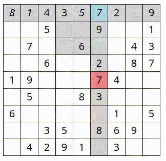

0. 適当なディレクトリでこのレポジトリを clone または download します。
1. https://www.kaggle.com/bryanpark/sudoku から`sudoku.csv`をダウンロードしてプロジェクトのroot (`sudoku.rb`があるフォルダ) に配置します。
2. `bundle install`
3. `ruby test_sudoku.rb`でテストが走ります。

#### Visualize

